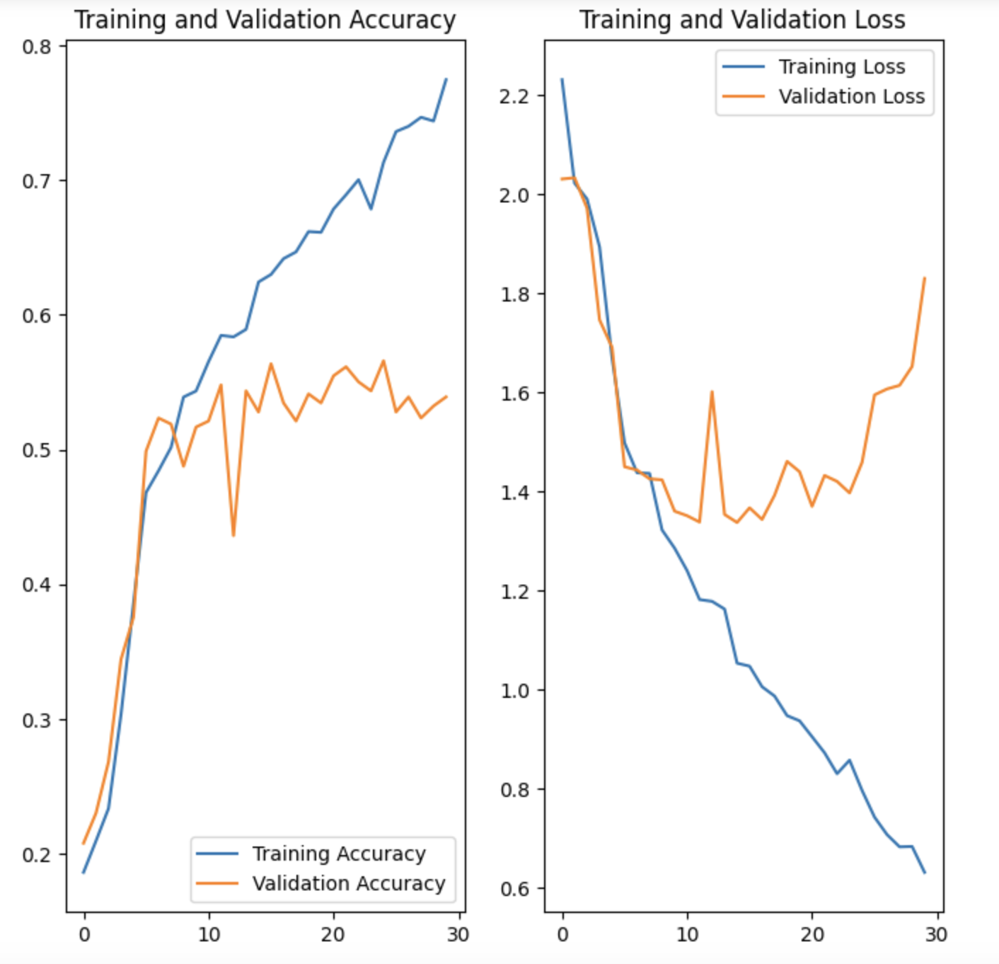
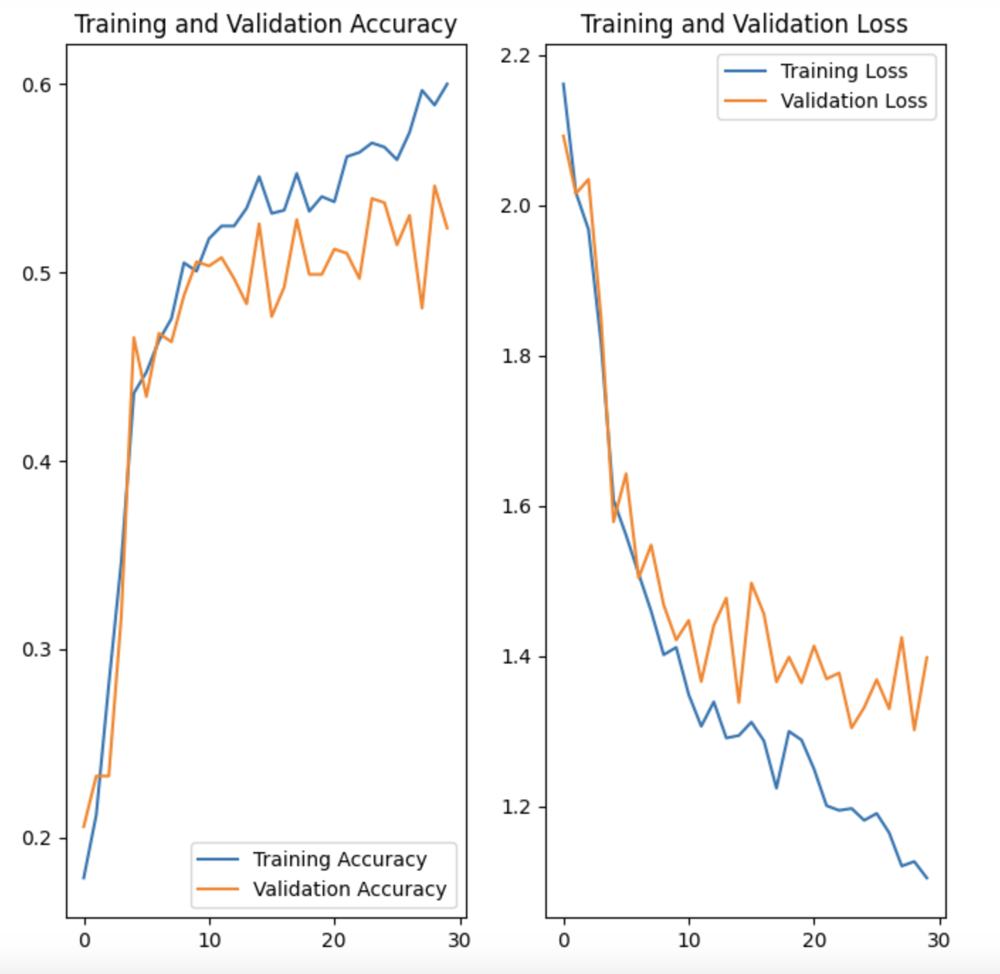
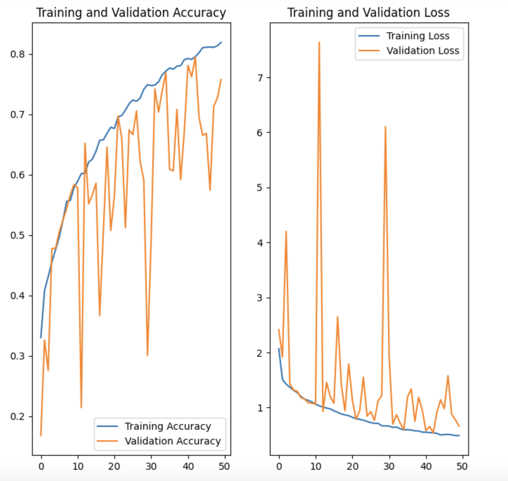
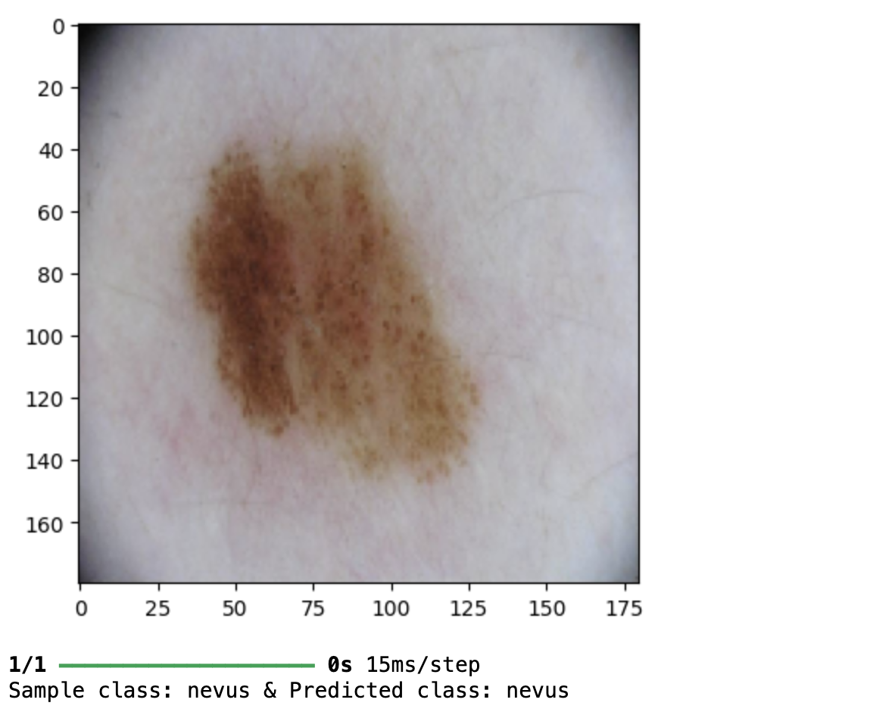
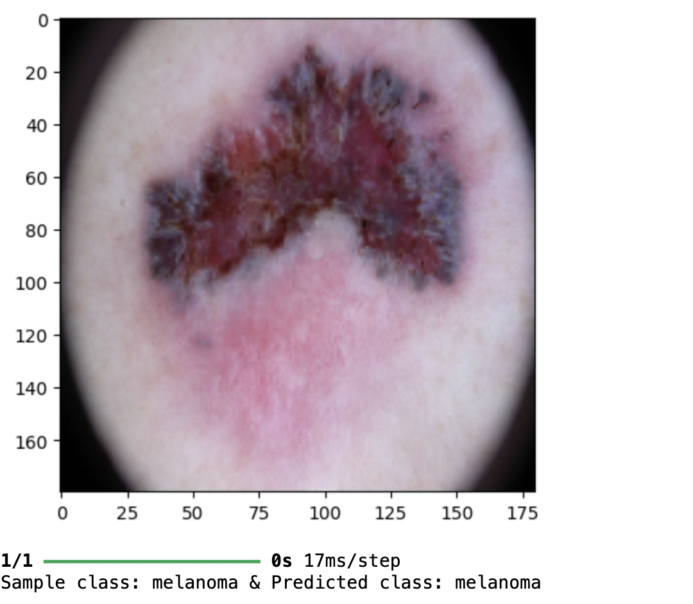
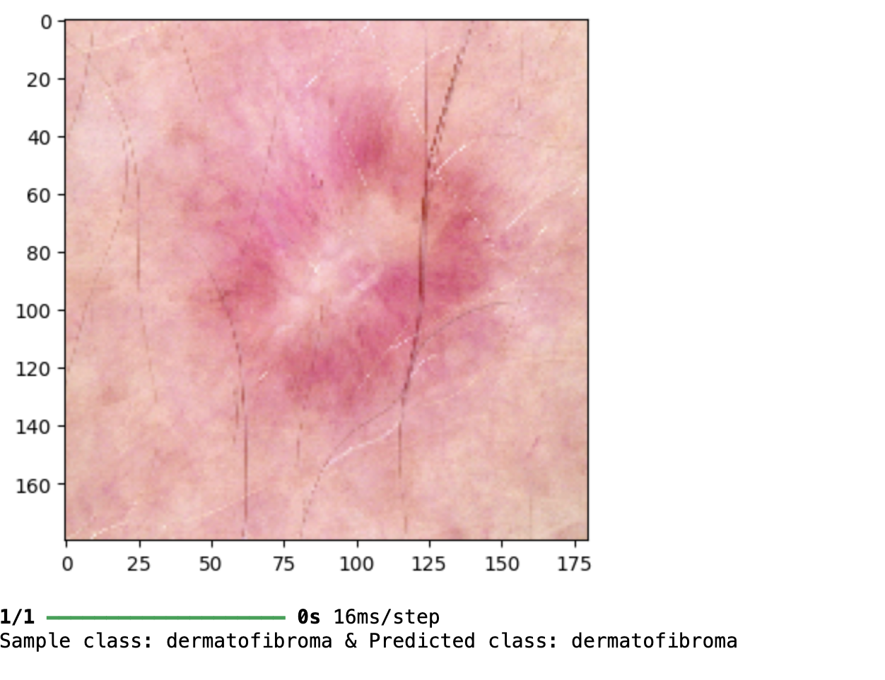
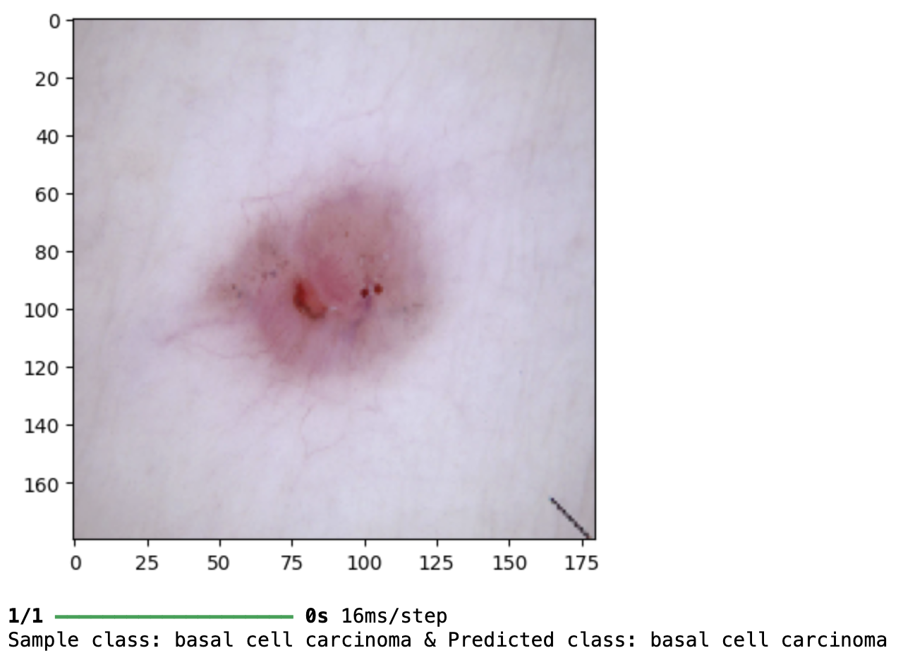

# Project Name
> Outline a brief description of your project.

## Table of Contents
* [General Info](#general-information)
* [Technologies Used](#technologies-used)
* [Conclusions](#conclusions)
* [Acknowledgements](#acknowledgements)

<!-- You can include any other section that is pertinent to your problem -->

## General Information

### Goal
- build a multiclass classification model using a custom convolutional neural network in TensorFlow. Custom Convolutional Neural Network with multiple layers to classify an image to one of the nine diseases.

### Dataset
- The dataset consists of 2357 images of malignant and benign oncological diseases, which were formed from the International Skin Imaging Collaboration (ISIC). All images were sorted according to the classification taken with ISIC, and all subsets were divided into the same number of images, with the exception of melanomas and moles, whose images are slightly dominant.
- The data set contains the following diseases:
    - Actinic keratosis
    - Basal cell carcinoma
    - Dermatofibroma
    - Melanoma
    - Nevus
    - Pigmented benign keratosis
    - Seborrheic keratosis
    - Squamous cell carcinoma
    - Vascular lesion
 
### Steps
- Data Reading/Data Understanding → Defining the path for train and test images 
- Dataset Creation→ Create train & validation dataset from the train directory with a batch size of 32. Also, make sure you resize your images to 180*180.
- Dataset visualisation → Create a code to visualize one instance of all the nine classes present in the dataset 
- Model Building & training 
- Model Building & training on the augmented data
- Class distribution: Examine the current class distribution in the training dataset 
- Handling class imbalances: Rectify class imbalances present in the training dataset with Augmentor library.
- Model Building & training on the rectified class imbalance data :
- Create a CNN model, which can accurately detect 9 classes present in the dataset. While building the model, rescale images to normalize pixel values between (0,1).
    - Choose an appropriate optimiser and loss function for model training
    - Train the model
    - Summarize findings

## Conclusions
### Basic Model

- Training Accuracy of the model increases with increase in epochs all the way to 80%.
- Validation Accuracy does not seem to have same tendency and it peaks around 55%.
- High training accuracy and low validation accuracy indicates overfitting by absorbing all the noise.

### Augmented Data Model

- Aumenting data has successfully mitigated the issue of overfitting.
- The model's training and validation accuracies are closely aligned
- However both training and validation accuracy have dropped reflecting poor performance and thus underfitting.

### Final Model after rectifying class imbalance

- The training accuracy and validation accuracy have increased.
- Class rebalance by using Augmentor has definitely helped in improving the accuracy.
- The training loss and validation accuracy and loss are aligned except for these steep spikes 10 & 30 epochs. 
- 40 epochs seems to be ideal with is closer to 80%

### Model Evaluations:

Sample 1           |  Sample 2
:-------------------------:|:-------------------------:
  |  

Sample 3           |  Sample 4
:-------------------------:|:-------------------------:
  |  

## Technologies Used
- python 3
- tensorflow - version 2.17.0
- pandas - version 2.0.2
- numpy - version 1.24.3
- seaborn - verison 0.13.2
- matplotlib- version 3.8.3

## Acknowledgements
- IIITB Executive PG Program in Machine Learning & AI

## Contact
Created by [@yeshwanthbr] - feel free to contact me!